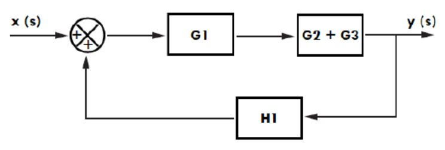
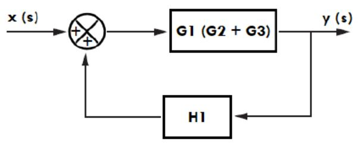
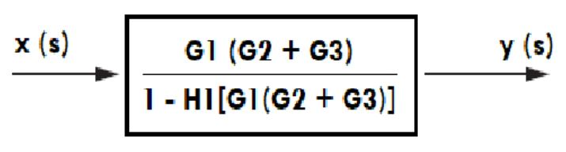
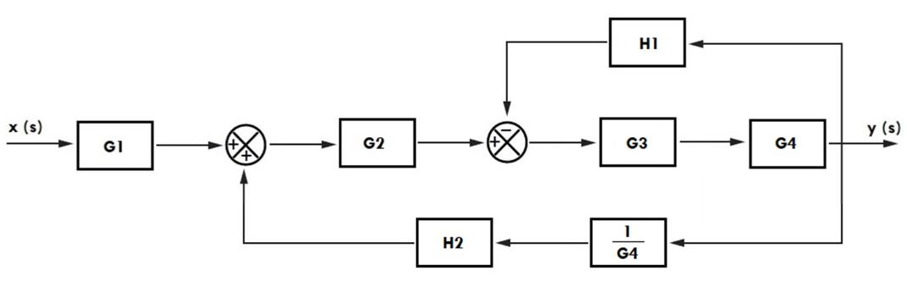
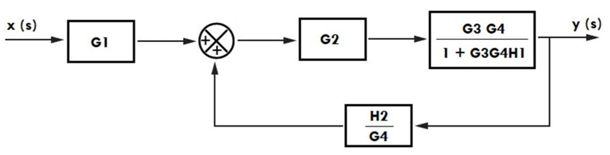
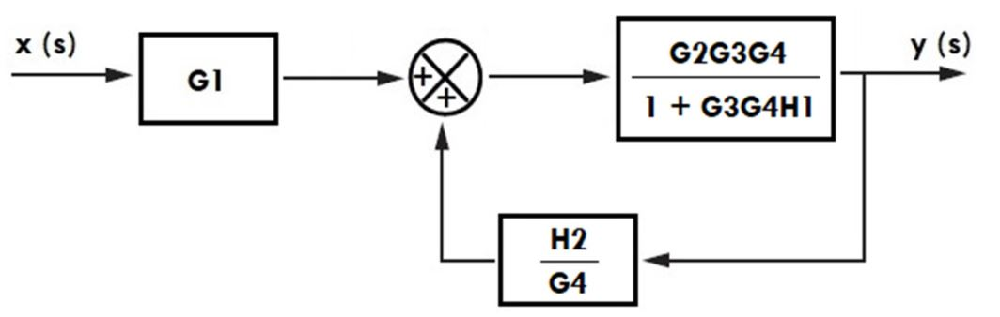
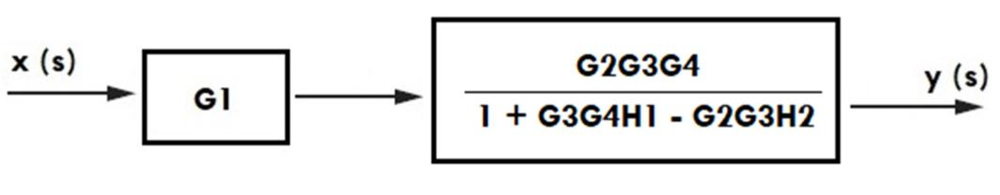
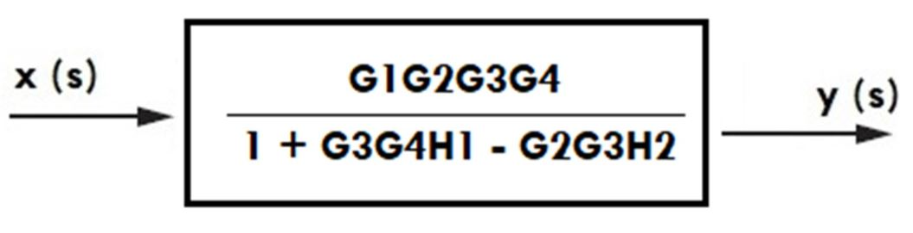

# Algebra de bloques
Cuando hablamos del álgebra de bloques en el contexto de la dinámica de sistemas y, específicamente, del primer sistema de control de James Watt, es importante aclarar que Watt no utilizó "álgebra de bloques" en el sentido moderno de la teoría de control si no que buscaba simplificar la interpretacion de su sistema de control para su máquina de vapor, conocido como el regulador centrífugo que fue un hito fundamental en la historia de la ingeniería y el control automático, desarrollado alrededor de 1788. Aunque Watt no lo diseñó usando diagramas de bloques ni álgebra de bloques, su invención encarna los principios de un sistema de control de lazo cerrado o retroalimentado, que es precisamente lo que el álgebra de bloques busca modelar y simplificar.
## Algebra de bloques
El Álgebra de Bloques es un conjunto de reglas y técnicas gráficas y matemáticas utilizadas principalmente en la ingeniería de control y la dinámica de sistemas para simplificar y analizar la relación entre las entradas y salidas de un sistema complejo. Imagina un sistema, como una máquina o un proceso, que está compuesto por varias partes que interactúan entre sí. El álgebra de bloques nos permite representar estas partes y sus interconexiones de una manera visual y sistemática.
## Elementos de un diagrama de bloques 
Un diagrama de bloques es una herramienta gráfica fundamental en la ingeniería de control y la dinámica de sistemas para representar las relaciones funcionales entre los componentes de un sistema.

### Bloque funcional
Los bloques son los rectángulos dentro del diagrama y representan los componentes individuales o subsistemas que conforman el sistema completo. Cada bloque tiene una función específica, la cual puede ser un elemento físico como un motor, un sensor o una válvula, o una operación matemática como un amplificador o un controlador. Su propósito es transformar una señal de entrada en una señal de salida según la función que le ha sido asignada, encapsulando así el comportamiento de una parte específica del sistema.

### Flechas
Las flechas o líneas de señal son las que conectan los bloques y otros elementos del diagrama, indicando la dirección en que fluye la información o la energía a través del sistema. Son esenciales porque establecen la relación de causalidad, es decir, muestran qué elemento está afectando a cuál y en qué sentido. La punta de la flecha siempre apunta hacia donde se dirige la señal, permitiendo visualizar la secuencia de operaciones y la interconexión entre las distintas partes del sistema.
### Punto suma 
Los puntos de suma son círculos con una cruz en su interior y se utilizan para combinar múltiples señales. A cada entrada que llega al punto de suma se le asigna un signo, que puede ser positivo (+) o negativo (-), indicando si esa señal debe sumarse o restarse al total. Estos elementos son particularmente importantes en los sistemas de control con retroalimentación, donde se usan para calcular la señal de error, que es la diferencia entre la señal de referencia (el valor deseado) y la señal de salida medida.
### Ramificación 
Los puntos de ramificación son simples puntos en una línea de señal donde la señal se divide para ser enviada a dos o más destinos diferentes. Su función es permitir que una misma señal sea utilizada por múltiples bloques o puntos de suma sin que su valor original se vea alterado. Esto es útil cuando la salida de un componente necesita alimentar varias partes del sistema simultáneamente, asegurando que todos los elementos que requieren esa información la reciban sin duplicidades innecesarias en el diagrama.
## interpretación del diagrama

## Reducción de diagramas de bloques 
La reducción del diagrama de bloques es un proceso sistemático para simplificar un diagrama de bloques complejo en una forma equivalente más sencilla, idealmente un solo bloque que represente la función de transferencia global del sistema. Esta simplificación es crucial para el análisis y diseño de sistemas de control, ya que permite determinar fácilmente la relación entre la entrada y la salida del sistema completo sin necesidad de considerar cada componente individualmente. La clave de la reducción es aplicar una serie de reglas algebraicas para combinar, mover y eliminar los elementos del diagrama.
### Proceso de Reducción

**Identificar configuraciones estándar** Buscar bloques en serie, en paralelo o lazos de retroalimentación.

**Aplicar reglas de simplificación** Reducir las configuraciones identificadas a un solo bloque.

**Reorganizar el diagrama** Mover puntos de suma o de ramificación si es necesario para crear nuevas configuraciones estándar que puedan ser simplificadas.

**Repetir** Continuar los pasos 1 a 3 hasta que el diagrama se reduzca a un solo bloque que represente la función de transferencia global del sistema, relacionando la salida principal con la entrada principal.

### Bloques en cascada 

Cuando dos o más bloques están conectados en serie, significa que la salida de un bloque se convierte directamente en la entrada del siguiente. Para simplificar esta configuración, se pueden reemplazar todos los bloques en serie por un único bloque cuya función de transferencia es el producto de las funciones de transferencia individuales de cada bloque. Esto refleja que el efecto acumulativo de varios procesos secuenciales es equivalente a un solo proceso que combina todas sus transformaciones.

### Bloques en paralelo

Los bloques en paralelo ocurren cuando múltiples bloques reciben la misma señal de entrada y sus salidas se suman (o restan) en un único punto de suma. Para reducir esta disposición, todos los bloques en paralelo se pueden reemplazar por un solo bloque cuya función de transferencia es la suma algebraica de las funciones de transferencia individuales. El signo en el punto de suma determinará si se suman o restan las funciones de transferencia, lo que representa cómo las distintas "vías" de procesamiento contribuyen al resultado final.

### Lazo de Retroalimentación

El lazo de retroalimentación es una de las configuraciones más importantes en control, donde la salida de un sistema se "retroalimenta" para influir en su propia entrada. Este lazo, que típicamente consta de un bloque en la trayectoria directa (G(s)) y un bloque en la trayectoria de retroalimentación (H(s)) que se conecta a un punto de suma para comparar la señal de entrada con la salida, se puede reducir a un único bloque. La función de transferencia de este bloque equivalente es  

Donde el signo en el denominador depende de si la retroalimentación es negativa (se resta la señal) o positiva (se suma la señal) en el punto de suma

### Movimiento de Puntos de Suma

La reubicación de un punto de suma es una técnica útil para reorganizar el diagrama y permitir nuevas simplificaciones. Si se necesita mover un punto de suma después de un bloque, las señales que originalmente se sumaban antes del bloque deben ser multiplicadas por la función de transferencia de ese bloque para compensar el cambio y mantener la equivalencia de la señal. Por el contrario, si un punto de suma se mueve antes de un bloque, las señales que se sumaban después del bloque deben ser divididas por la función de transferencia de ese bloque para asegurar que la señal final sea la misma.

### Movimiento de Puntos de Ramificación

Mover un punto de ramificación también es clave para reestructurar el diagrama. Si un punto de ramificación se mueve después de un bloque, se debe insertar un bloque adicional con la función de transferencia inversa (1/G(s)) en la rama donde se originó la señal para asegurar que la señal en esa rama se mantenga idéntica a la original. Si, por otro lado, un punto de ramificación se mueve antes de un bloque, entonces se debe insertar un bloque con la función de transferencia del bloque original (G(s)) en la rama para asegurar la equivalencia de la señal transmitida.

## Propiedades

## Aplicación de un diagrama de bloques 

## 7. Ejercicios
### 📚Ejercicio 1

### 📚Ejercicio 2

## 8. Conclusiones
El álgebra de bloques es una herramienta fundamental para simplificar sistemas de control representados mediante diagramas de bloques, permitiendo reducir múltiples componentes interconectados a una única función de transferencia equivalente.

Las reglas de reducción de bloques —como la combinación en serie, paralelo, retroalimentación y movimiento de ramas— permiten transformar un diagrama complejo en una representación más simple y manejable, facilitando el análisis del sistema.

La correcta aplicación de estas reglas requiere precisión en la identificación de entradas, salidas y lazos de realimentación, así como una adecuada interpretación de la dirección del flujo de señal.

Una simplificación incorrecta puede alterar completamente el comportamiento dinámico del sistema, por lo tanto, es fundamental aplicar el álgebra de bloques con rigor y seguir un procedimiento ordenado.
## 9. Bibliografia 

[ChatGPT] (https://openai.com/chatgpt)

[Katsuhiko Ogata] (dinamica de sistemas.PHH prentice Hall)

[Lidefer] (https://fjferrer.webs.ull.es/Apuntes3/Leccion01/15_dinmica_de_los_sistemas_mecanicos.html)

