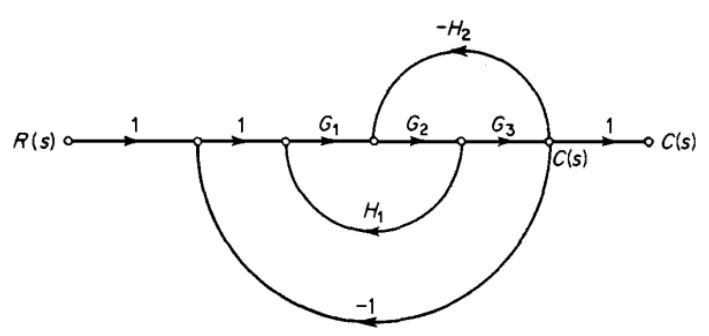
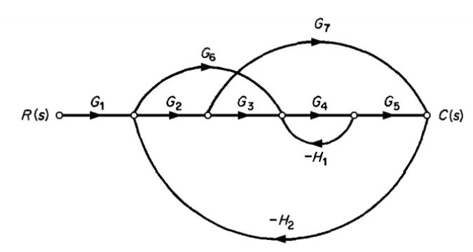
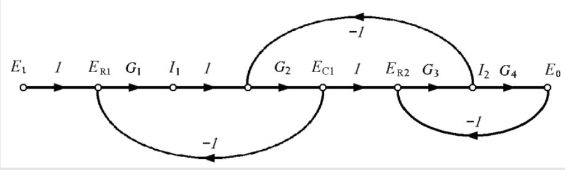

# Diagrama de flujo de señales
## 1 Diagrama de flujo de señales
En dinámica de sistemas, un diagrama de flujo de señales es una representación gráfica que ilustra las relaciones de causa y efecto entre las variables de un sistema. Utiliza nodos para representar variables y flechas direccionales (ramas) para indicar la transmisión de señales entre ellas, con ganancias asociadas a cada rama que denotan la intensidad y el signo de la influencia. Es una herramienta poderosa para analizar y visualizar sistemas complejos, permitiendo derivar funciones de transferencia y comprender el comportamiento dinámico sin necesidad de escribir ecuaciones explícitas de cada componente individual.
## 2 Elementos de los diagramas de flujo
### 2.1 Nodo
Los nodos, representados como puntos o pequeños círculos en el diagrama de flujo de señales, actúan como las variables o puntos de suma/distribución dentro del sistema. Son los puntos donde las señales se combinan, ya sea sumándose algebraicamente si múltiples flechas llegan a un nodo, o dividiéndose y transmitiéndose idénticamente a través de múltiples ramas si varias flechas salen de él. Se distinguen entre nodos de entrada (fuentes), de los que solo salen ramas y representan las excitaciones del sistema; nodos de salida (sumideros), a los que solo llegan ramas y representan las variables de interés; y nodos intermedios, que son puntos de procesamiento de señal o variables internas.
### 2.2 Flecha
Las ramas, visualizadas como líneas dirigidas con flechas que conectan dos nodos, simbolizan la relación funcional y la transmisión de una señal de un nodo a otro, siempre en la dirección que indica la flecha. Cada rama posee una "ganancia" asociada, un valor que se coloca junto a la flecha y que define la magnitud o el tipo de modificación que experimenta la señal al pasar por esa conexión. Esta ganancia puede ser una constante numérica, una función de transferencia en el dominio de Laplace, o cualquier otro operador que describa la transformación de la señal, siendo fundamental para cuantificar la influencia de una variable sobre otra.
## 3 Interpretacion de los diagramas de flujo de señales 
La interpretación de un diagrama de flujo de señales en dinámica de sistemas va más allá de solo identificar nodos y ramas; implica comprender cómo las señales se propagan, interactúan y se modifican a medida que atraviesan el sistema. Aquí te detallo los aspectos clave para su interpretación:
## 4 Conceptos para interpretar un diagrama de flujo de señales 
### 4.1 Camino o trayectoria 
Es un camino que se inicia en un nodo de entrada (fuente) y termina en un nodo de salida (sumidero), y en el cual ningún nodo se atraviesa más de una vez. Estos caminos representan la transmisión directa de una señal desde la entrada a la salida del sistema.
### 4.2 Trayecto o camino directo 
En un diagrama de flujo de señales, un trayecto (o camino) directo se define como una secuencia continua de ramas que comienza en un nodo de entrada (fuente) y termina en un nodo de salida (sumidero), sin que ningún nodo sea visitado más de una vez.
### 4.3 Ganancia de trayecto directo 
La ganancia de trayecto directo en un diagrama de flujo de señales se define como el producto de las ganancias de todas las ramas individuales que constituyen un camino ininterrumpido desde un nodo de entrada hasta un nodo de salida.
### 4.3 Lazo 
Es un camino cerrado que se origina y termina en el mismo nodo, y en donde ningún otro nodo se atraviesa más de una vez. Los lazos representan los caminos de retroalimentación dentro del sistema.
### 4.4 Ganancia de lazo  
En el contexto de un diagrama de flujo de señales, la ganancia de lazo se refiere al producto de las ganancias de todas las ramas que componen un lazo

## 5 Comparacion entre diagrama de bloques y diagrama flujo de señales 

| Característica      | Diagrama de Bloques                                  | Diagrama de Flujo de Señales                               |
| :------------------ | :--------------------------------------------------- | :--------------------------------------------------------- |
| **Representación** | Bloques, líneas, sumadores, puntos de bifurcación    | Nodos, ramas (con ganancias)                               |
| **Enfoque** | Interconexión de componentes/subsistemas           | Flujo de señales y relaciones causa-efecto                 |
| **Operaciones** | Suma/resta y bifurcación explícitas                  | Suma/distribución implícitas en nodos                      |
| **Obtención F.T.** | Reducción secuencial de bloques                     | Fórmula de Ganancia de Mason (directa)                     |
| **Complejidad** | Se vuelve tedioso con sistemas grandes/muchos lazos  | Más eficiente para sistemas complejos (una vez dominado)   |
| **Visualización** | Más intuitivo para la estructura física/funcional   | Más abstracto, enfocado en el flujo de señal               |

Los diagramas de bloques son excelentes para la representación conceptual y la comprensión de la estructura física del sistema, mientras que los diagramas de flujo de señales son herramientas analíticas más potentes y compactas, especialmente diseñadas para la derivación sistemática de funciones de transferencia en sistemas complejos mediante la Fórmula de Ganancia de Mason. A menudo, un diagrama de bloques se convierte en un diagrama de flujo de señales para facilitar el análisis matemático.

## 6 Formula de Mason

La Fórmula de Ganancia de Mason (o Regla de Ganancia de Mason) es una potente herramienta utilizada en el análisis de sistemas de control para determinar la función de transferencia de un sistema directamente de su diagrama de flujo de señales, sin la necesidad de reducir el diagrama paso a paso como se hace con los diagramas de bloques.
La fórmula general para la función de transferencia T de un sistema (relación entre la salida Y(s) y la entrada R(s)) es:

$$T = \frac{Y(s)}{R(s)} = \frac{1}{\Delta} \sum_{k=1}^{N} P_k \Delta_k$$

💡**Ejemplo 1:**  

Figura 8

$$\text{Trayectoria directa}$$
$$P_1 = 1 * 1 * G_1 * G_2 * G_3 * 1 = G_1 G_2 G_3$$
$$\text{Lazos cerrados}$$
$$L_1 = G_1 G_2 H_1$$
$$L_2 = -G_2 G_3 H_2$$
$$L_3 = -G_1 G_2 G_3$$
$$\Delta = 1 - (L_1 + L_2 + L_3) \quad \$$
$$\Delta_1 = 1 \quad \text{Cofactores}$$
$$\frac{C(s)}{R(s)} = \frac{P_1 \Delta_1}{\Delta} = \frac{G_1 G_2 G_3}{1 - G_1 G_2 H_1 + G_2 G_3 H_2 + G_1 G_2 G_3}$$

💡**Ejemplo 2:** 

Figura 8

$$\text{Trayectoria directa}$$
$$P_1 = G_1 G_2 G_3 G_4 G_5$$
$$P_2 = G_1 G_6 G_4 G_5$$
$$P_3 = G_1 G_2 G_7$$
$$\text{Lazos cerrado}$$
$$L_1 = -G_4 H_1$$
$$L_2 = -G_2 G_7 H_2$$
$$L_3 = -G_6 G_4 G_5 H_2$$
$$L_4 = -G_2 G_3 G_4 G_5 H_2$$
$$\text{Determinante}$$
$$\Delta = 1 - (L_1 + L_2 + L_3 + L_4) + L_1 L_2$$
$$\Delta_1 = 1$$
$$\Delta_2 = 1$$
$$\Delta_3 = 1 - L_1$$
$$\frac{C(s)}{R(s)} = \frac{G_1 G_2 G_3 G_4 G_5 + G_1 G_6 G_4 G_5 + G_1 G_2 G_7 (1 + G_4 H_1)}{1 + G_4 H_1 + G_2 G_7 H_2 + G_6 G_4 G_5 H_2 + G_2 G_3 G_4 G_5 H_2 + G_4 H_1 G_2 G_7 H_2}$$

💡**Ejemplo 3:** 

Figura 8

$$\text{Trayectoria directa}$$
$$P_1 = G_1 G_2 G_3 G_4$$
$$\text{Lazos cerrado}$$
$$L_1 = -G_1 G_2$$
$$L_2 = -G_2 G_3$$
$$L_3 = -G_3 G_4$$
$$\text{Determinante}$$
$$\Delta = 1 - (L_1 + L_2 + L_3)$$
$$\Delta = 1 + G_1 G_2 + G_2 G_3 + G_3 G_4$$
$$\Delta_1 = 1$$
$$\frac{E_0}{E_1} = \frac{G_1 G_2 G_3 G_4}{1 + G_1 G_2 + G_2 G_3 + G_3 G_4}$$

## 7. Ejercicios
### 📚Ejercicio 1
### 📚Ejercicio 2
## 8. Conclusiones

El modelo de sistemas hidraulicos es uno de los mas versatiles ya que permite modelar modelar cada tanque de manera independiente segun la variable que se requiera, y despues buscar una incognita que me permita relacionar todos los sistemas en funcion de construir un modelo en general. Una vez diseñado o en operación, los modelos permiten predecir y analizar el rendimiento del sistema ante diferentes cargas, perturbaciones o cambios en los parámetros. Esto ayuda a comprender el comportamiento dinámico, identificar posibles cuellos de botella, evaluar la eficiencia y prever la respuesta ante situaciones inesperadas.

## 9. Bibliografia 

[ChatGPT] (https://openai.com/chatgpt)

[Katsuhiko Ogata] (dinamica de sistemas.PHH prentice Hall)

[Lidefer] (https://fjferrer.webs.ull.es/Apuntes3/Leccion01/15_dinmica_de_los_sistemas_mecanicos.html)
